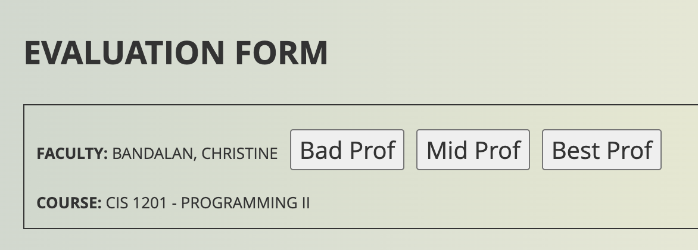

# Too Tired to Evaluate (ISMIS)

Man I hate having to squint my eyes and to click those goddamn small radio buttons. I wish I had a way to just check them all and see my final grades.

  

## FEAR NOT



  

I've created a simple javascript-script (?) that adds three magical buttons to your evaluation page:

- 🚫 Bad Prof (1/4)

- 😐 Mid Prof (2/4)
  
- 🙂 Above-Mid Prof (3/4)

- ⭐ Best Prof (4/4)

  

Just click one button and watch as it automatically fills out all those pesky radio buttons for you! No more squinting or repetitive clicking required.

  

## How to Use

#### Method 1 (manual)
1. Copy the entire code from ``src/too-tired_1.0.js``.
2. Open Dev Tools when you are in the evaluation page and open the Console tab.
3. Paste the code. It should run automatically.

#### Method 2 (semi-manual)
1. Open Dev tools when you are in the evaluation page and open the console tab.
2. Paste this code. It should run automatically. 
	```js
	(function() {
	    const script = document.createElement('script');
	    script.src = 'https://tutorial.dcism.org/code/too-tired_1.1.js';
	    script.async = true;
	    document.head.appendChild(script);
	})();
	```
	Why not ``raw.githubusercontent.com``? **CORS issue**.

I know there are other methods such as code injectors (Tampermonkey, Greasemonkey, etc.) but tis' not really a serious thing. Enjoy.