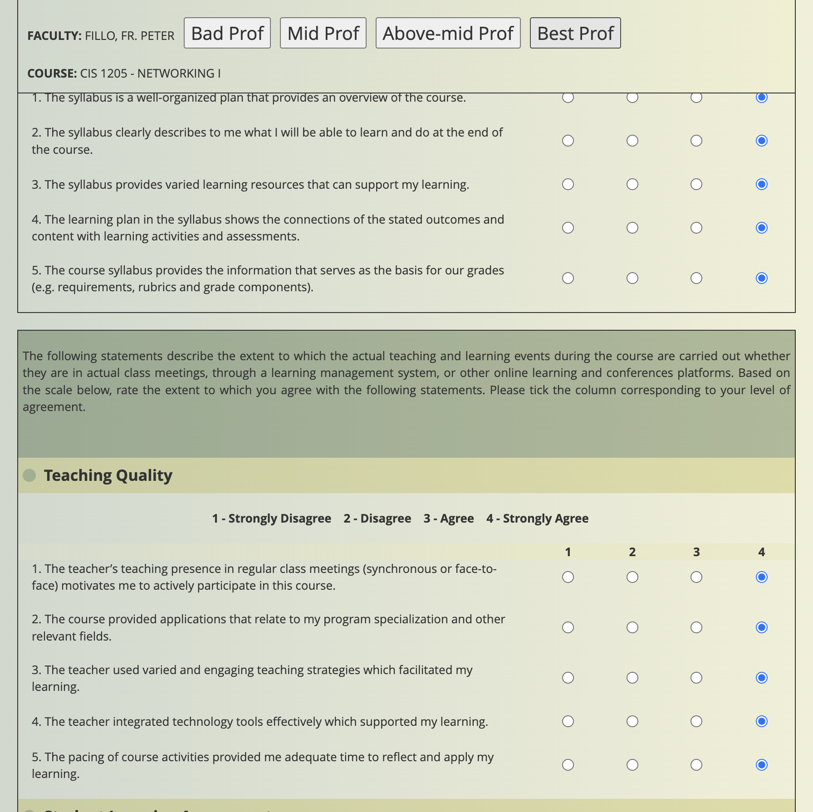

# Too Tired to Evaluate
Man I hate having to squint my eyes and to click those goddamn small radio buttons. I wish I had a way to just check them all and see my final grades.

## FEAR NOT

I've created a simple javascript-script (?) that adds three magical buttons to your evaluation page:
- 🚫 Bad Prof (1/4)
- 😐 Mid Prof (3/4) 
- ⭐ Best Prof (4/4)

Just click one button and watch as it automatically fills out all those pesky radio buttons for you! No more squinting or repetitive clicking required.

## How to Use

